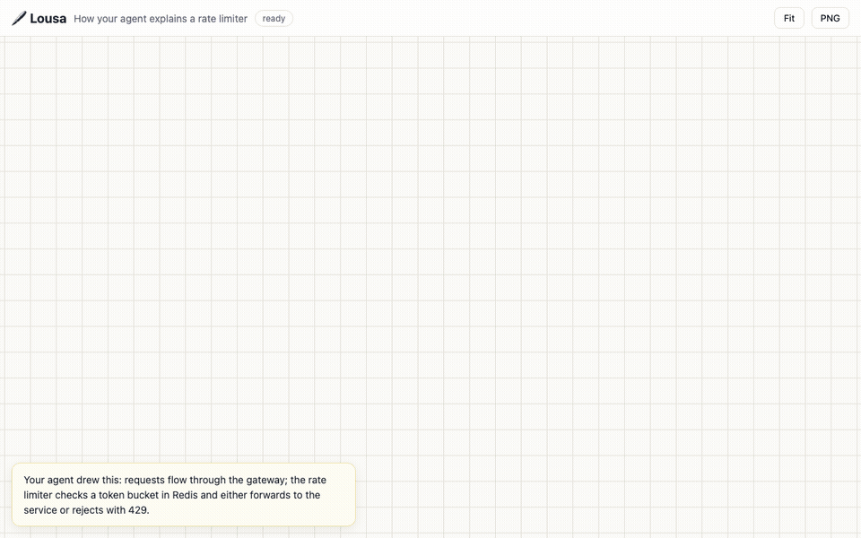

# Lousa

**A whiteboard where your AI agent draws its explanations.**



Ask your agent *"explain this visually"* and it sketches an animated, hand-drawn diagram on a live board — instead of another wall of text. Lousa is an MCP server + web viewer: the agent authors a declarative scene (boxes, arrows, cylinders, notes), and the board renders it stroke by stroke, as if someone were drawing it in front of you.

> *Lousa* is Portuguese for the classic school blackboard.

## Why it's different

- **The agent is the artist.** No prompt box, no OCR — your coding agent already has the context and draws through typed MCP tools.
- **Live, incremental drawing.** Follow-ups edit the scene; the open tab animates only what changed, like watching the diagram evolve.
- **Point at things.** Click elements in the viewer to select them, then tell your agent *"improve what I selected"* — it reads your selection through `get_selection` and targets exactly that.
- **Boards expire by default** (12h, sliding) — a whiteboard, not a document graveyard. `ttlHours: 0` keeps a board forever.

## Quick start

Requires [Node.js 18.17+](https://nodejs.org).

```bash
# Claude Code
claude mcp add lousa -- npx -y lousa mcp

# or run the server directly
npx lousa            # viewer at http://127.0.0.1:4666
```

Any MCP host works — for stdio configuration use command `npx`, args `["-y", "lousa", "mcp"]`. The stdio endpoint auto-starts the local server, so the viewer is always available. Then ask your agent to *"draw how our auth flow works"* and open the URL it returns.

## MCP tools

| Tool | What it does |
|---|---|
| `create_board` | Creates a board from a scene, returns `{id, url}` |
| `update_board` | Replaces the scene; unchanged elements stay byte-identical so only changes animate |
| `get_board` / `list_boards` | Read boards |
| `get_selection` | What the user selected in the viewer (ids + full elements) |
| `delete_board` | Deletes a board |

The scene is a JSON array of elements — `box`, `ellipse`, `diamond`, `cylinder`, `arrow` (connects ids), `line`, `text`, `note` — rendered with [rough.js](https://roughjs.com). The full schema ships inside the tool definitions; agents need no extra setup.

## Self-hosting a shared server

Run `lousa` on any Node host and point machines at it:

```bash
LOUSA_TOKEN=<secret> HOST=0.0.0.0 npx lousa        # server
LOUSA_URL=https://your-host LOUSA_TOKEN=<secret> npx lousa mcp   # each client
```

`LOUSA_TOKEN` gates board listing/creation/deletion and `/mcp`; per-board URLs act as capability links. AWS Lambda + S3 deployment is supported out of the box (`lambda.js` handler + `LOUSA_BUCKET` for storage); any HTTPS front (API Gateway, etc.) works.

| Env var | Default | Purpose |
|---|---|---|
| `PORT` / `HOST` | `4666` / `127.0.0.1` | server bind |
| `LOUSA_DATA_DIR` | `~/.lousa/boards` | filesystem board storage |
| `LOUSA_BUCKET` | — | use S3 storage instead of filesystem |
| `LOUSA_TOKEN` | — | require bearer token (header or `?t=`) on global routes and MCP |
| `LOUSA_URL` | — | `lousa mcp` proxies to this remote server |
| `LOUSA_DEFAULT_TTL_HOURS` | `12` | default board expiry |

## Development

```bash
npm install
npm test          # node --test
node cli.js       # local server
```

## License

[AGPL-3.0](LICENSE) © Henrique Pires
